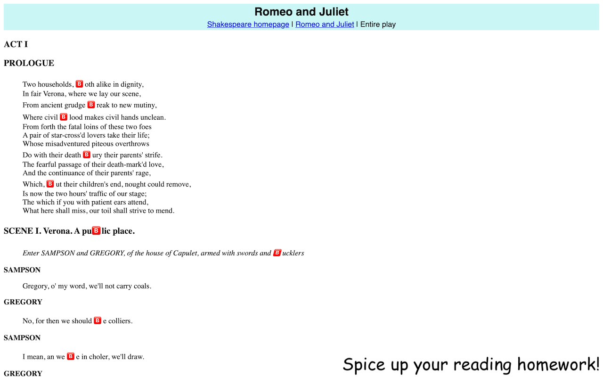
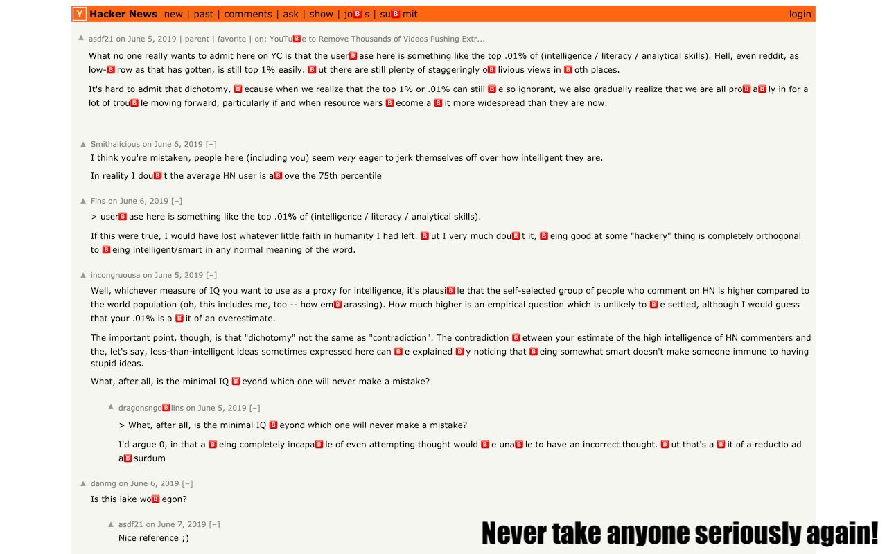

# 🅱️

Replace the letter B with the 🅱️ emoji everywhere.

## Features
- Click on extension icon to disable for one domain
- Works on content fetched dynamically after page load
- Fast even on heavy pages
